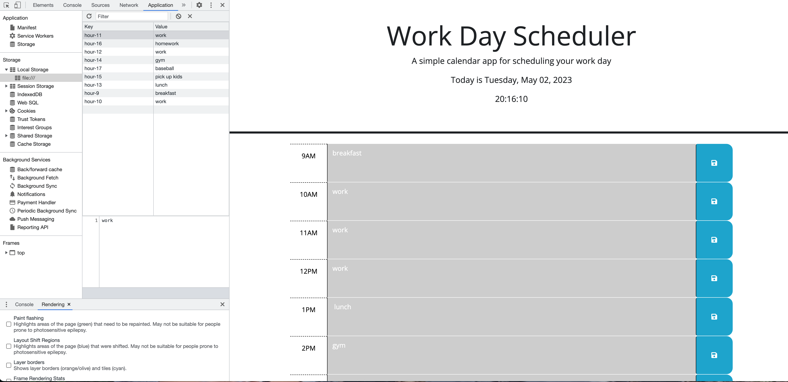

# project-tracker

## User Story

```md
AS AN employee with a busy schedule
I WANT to add important events to a daily planner
SO THAT I can manage my time effectively
```

## Acceptance Criteria

```md
GIVEN I am using a daily planner to create a schedule
WHEN I open the planner
THEN the current day is displayed at the top of the calendar (DONE)
WHEN I scroll down
THEN I am presented with timeblocks for standard business hours (DONE)
WHEN I view the timeblocks for that day
THEN each timeblock is color coded to indicate whether it is in the past, present, or future (DONE)
WHEN I click into a timeblock
THEN I can enter an event (DONE)
WHEN I click the save button for that timeblock
THEN the text for that event is saved in local storage (DONE)
WHEN I refresh the page
THEN the saved events persist (DONE)
```

## Description

See under User Story

## Installation

The link to deployed application is: https://esztergb.github.io/project-tracker/
Github link: https://github.com/Esztergb/project-tracker.git



## Usage

N/A 

## Credits

Thank you for tips and sugestions from Bootcamp instructors and classmates. 
I have used https://www.w3schools.com/ and https://www.stackoverflow.com to research information.

## License

N/A - Bootcamp Challange 5